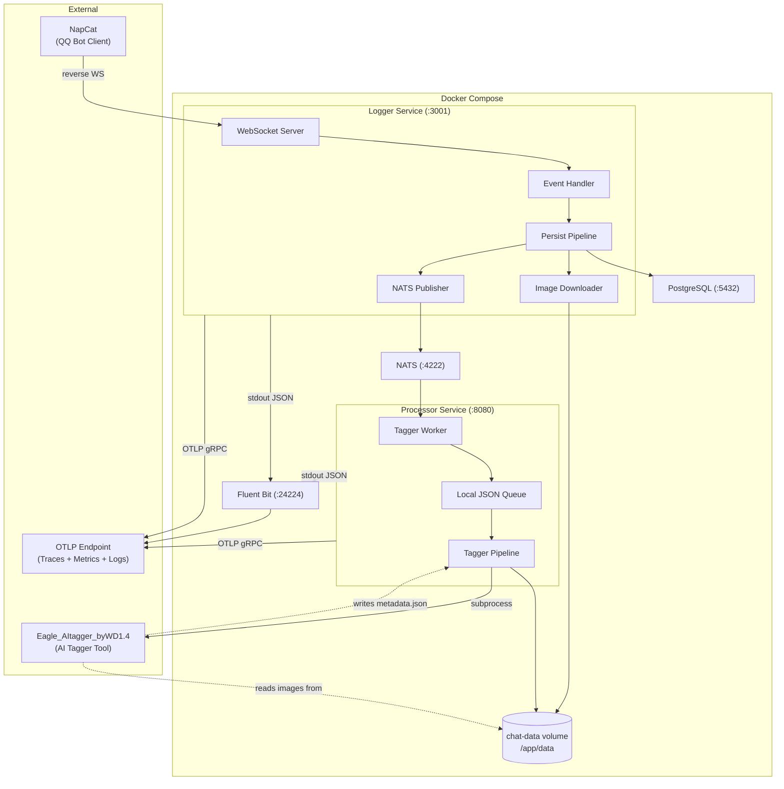
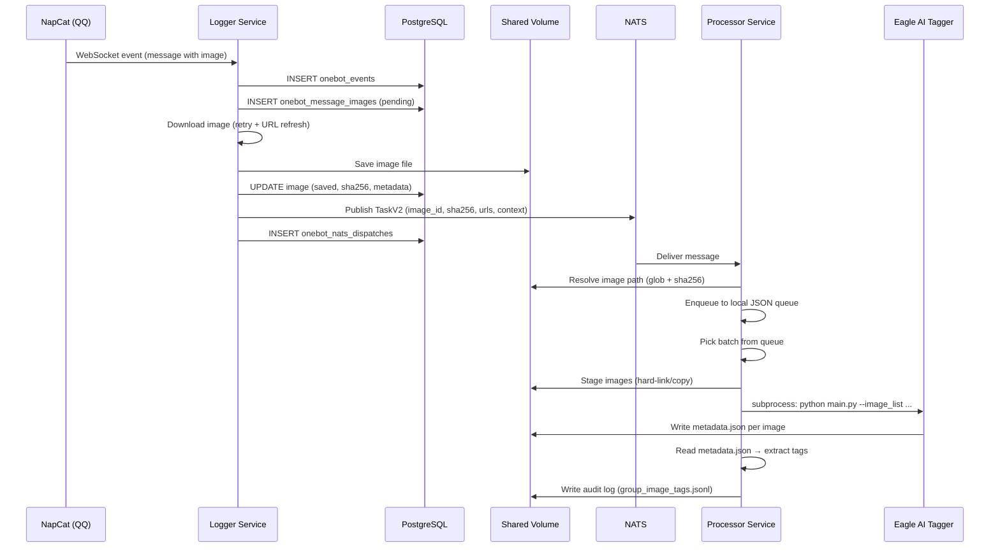
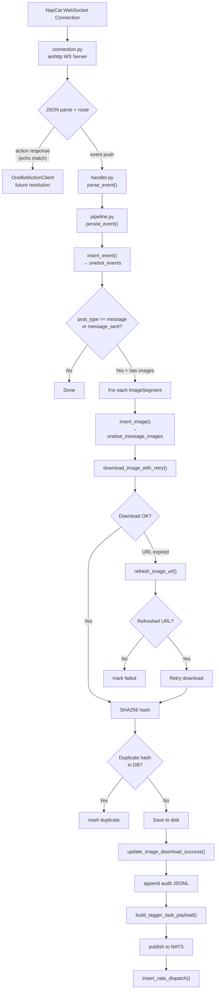
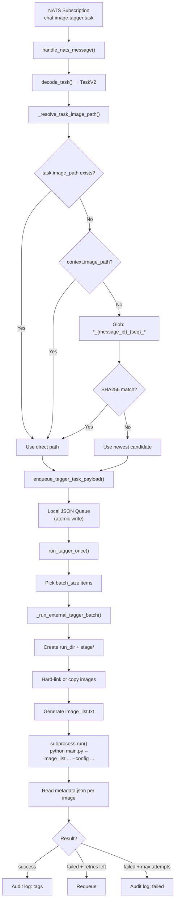
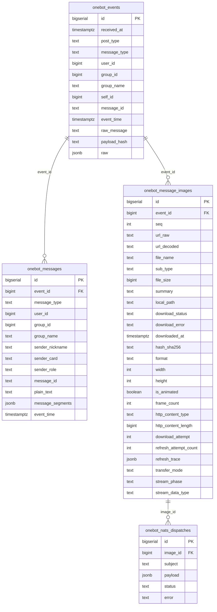
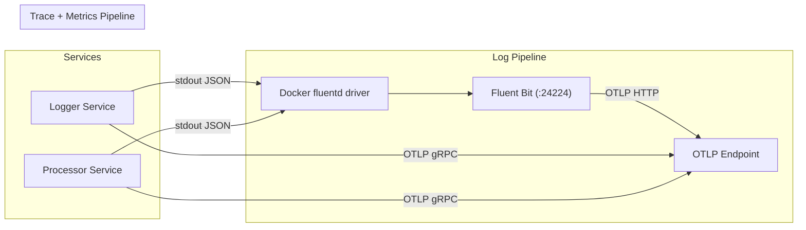

# Agents Guide (data-assistant)

This repo is a two-service pipeline that ingests QQ chat events via NapCat OneBot11 reverse WebSocket,
persists events and images to PostgreSQL, and dispatches image tagging tasks to an external AI tagger
(Eagle_AItagger_byWD1.4) through NATS messaging.

## System Architecture

### System Topology



### Data Flow



### Logger Service

Entry point: `python3 -m logger_service.service.main`

Receives all NapCat OneBot11 events, persists them to PostgreSQL, downloads chat images to shared storage, and publishes tagging tasks to NATS.



URL refresh chain (when image URL expires): `nc_get_rkey → get_image → get_file → get_msg`. Each action is attempted in order via the NapCat action channel. Stops at the first action that returns a valid HTTP URL.

### Processor Service

Entry point: `python3 -m processor_service.service.main`

Subscribes to NATS tagging tasks, resolves image file paths on shared storage, queues them locally, and runs the external tagger in batches via subprocess.



### Shared Contract

Services communicate via NATS using `contracts/chat_image_task.py`:

```
TaskV2 {
    version: int           # Protocol version (currently 2)
    image_id: int          # DB primary key from onebot_message_images
    sha256: str            # SHA256 hash of downloaded image
    source_url: str        # URL used for successful download
    original_url: str      # Original URL from OneBot event
    context: dict          # event_id, chat_type, chat_id, message_id, seq, etc.
    image_path: str | None # Optional explicit file path (not set in normal flow)
}
```

V1 payloads (legacy `{image_path, context}` without `version` field) are transparently decoded into TaskV2.

### External Tool Contract

Eagle_AItagger_byWD1.4 is invoked as a CLI subprocess. It is **not included** in this repository and must be manually installed on the host.

- **Input**: `--image_list <path>` text file, one image absolute path per line.
- **Output**: `metadata.json` written alongside each input image: `{"tags": [...]}`
- **Mount**: Host directory bind-mounted read-only into processor container at `/opt/tagger`.

### Database Schema



Image status lifecycle: `pending → saved | duplicate | failed`

### Observability



Key metrics:

| Service | Metric | Type | Description |
|---------|--------|------|-------------|
| Logger | `logger_events_total` | Counter | Events by persist outcome + post_type |
| Logger | `logger_images_total` | Counter | Image processing outcomes |
| Logger | `logger_image_process_duration_ms` | Histogram | Image processing latency |
| Logger | `logger_nats_publish_total` | Counter | NATS publish attempts by outcome |
| Logger | `logger_nats_publish_latency_ms` | Histogram | NATS publish latency |
| Processor | `processor_nats_messages_total` | Counter | NATS messages handled by outcome |
| Processor | `processor_nats_message_handle_latency_ms` | Histogram | Message handling latency |
| Processor | `processor_queue_enqueued_total` | Counter | Queue enqueue by outcome |
| Processor | `processor_queue_depth` | Histogram | Queue depth samples |
| Processor | `processor_tagger_batches_total` | Counter | Tagger batch outcomes |
| Processor | `processor_tagger_items_total` | Counter | Tagger item outcomes |
| Processor | `processor_tagger_batch_latency_ms` | Histogram | Tagger batch latency |

### Filesystem Layout (Runtime)

```
/app/data/                              # Shared Docker volume (chat-data)
├── chat_images/                        # Image storage root
│   ├── group/<group_id>/               # Group chat images
│   │   └── <timestamp>_<msg_id>_<seq>_<filename>
│   └── private/<user_id>/              # Private chat images
│       └── <timestamp>_<msg_id>_<seq>_<filename>
├── chat_image_tagger_queue.json        # Processor local task queue
├── chat_image_tagger_runs/             # Tagger staging (ephemeral)
│   └── <run_id>/
│       ├── image_list.txt
│       └── stage/00000.info/
│           ├── <image_file>            # Hard-linked from chat_images/
│           └── metadata.json           # Written by tagger
├── group_image_tags.jsonl              # Tagger audit log (tag results)
└── group_images.jsonl                  # Logger image audit log
```

### Network Ports

| Service | Port | Protocol | Purpose |
|---------|------|----------|---------|
| Logger | 3001 | WS | NapCat reverse WebSocket + `/health` |
| Processor | 8080 | HTTP | `/health` endpoint |
| NATS | 4222 | TCP | Client connections |
| NATS | 8222 | HTTP | Monitoring |
| PostgreSQL | 5432 (→25432) | TCP | Database |
| pgAdmin | 80 (→25050) | HTTP | DB admin UI |
| Fluent Bit | 24224 | TCP/UDP | Log forwarding (fluentd protocol) |

### Known Limitations

1. **Tags not persisted to DB** — Tagger results only go to `group_image_tags.jsonl`; no structured query capability for tags.
2. **Legacy core NATS mode is best-effort** — JetStream is enabled by default; if `CHAT_IMAGE_NATS_JETSTREAM_ENABLED=false`, messages can still be lost when no subscriber is active.
3. **No tag-based classification** — Images stay in their original directory; no post-tagging reorganization.
4. **External tagger dependency** — Eagle_AItagger_byWD1.4 must be manually installed; not pulled or managed by this project.
5. **Single audit log file** — `group_image_tags.jsonl` grows unbounded with no rotation.

## Commands

### Setup (local dev)

- Create venv (recommended):
  - `python -m venv .venv`
  - `source .venv/bin/activate`
- Install runtime deps:
  - `python -m pip install -U pip`
  - `python -m pip install -r requirements.txt`

Python requirement: `>=3.10` (Dockerfiles use `python:3.11-slim`).

### Run (local)

- Logger service (NapCat reverse WS server):
  - `python3 -m logger_service.service.main`
- Processor service (tagger worker):
  - `python3 -m processor_service.service.main`
  - or `python3 -m processor_service.service.chat_image.tagger_worker`
- Manual local tagging (no NATS):
  - `python3 -m processor_service.service.chat_image.tagger_cli`
  - one batch: `python3 -m processor_service.service.chat_image.tagger_cli --once`

### Docker Compose (logger + processor + NATS)

- Prepare env:
  - `cp .env.example .env`
  - set `CHAT_IMAGE_TAGGER_TOOL_ROOT_HOST` in `.env` (host path to Eagle_AItagger_byWD1.4)
- Start (recommended order):
  - `docker compose up -d nats fluent-bit processor`
  - `docker compose up -d logger`
- Logs: `docker compose logs -f logger processor fluent-bit nats`
- Stop: `docker compose down`

### Tests

Tests are `unittest`-based (including async via `unittest.IsolatedAsyncioTestCase`).

- Run all tests:
  - `python3 -m unittest discover -s tests -p 'test_*.py'`

- Run a single test module:
  - `python3 -m unittest tests.test_chat_image_storage`

- Run a single test class:
  - `python3 -m unittest tests.test_chat_image_tagger_worker.TestChatImageTaggerWorker`

- Run a single test method:
  - `python3 -m unittest tests.test_chat_image_tagger_pipeline.TestChatImageTaggerPipeline.test_run_once_success`

### Lint / Format

There is no repo-pinned linter/formatter config (no `ruff.toml`, `pyproject` tool config, etc.).

- Minimal sanity check:
  - `python3 -m compileall .`

- Optional (if you install ruff locally):
  - `python -m pip install ruff`
  - `ruff check .`
  - `ruff format .`

## Code Style (follow existing patterns)

### Imports

- If a module uses postponed annotations, keep `from __future__ import annotations` as the first import.
- Group imports: stdlib, third-party, then local.
- Prefer package-relative imports inside service packages (e.g. `from .audit import ...`).
- Tests typically import via the repo root package path (e.g. `from logger_service.service...` or `from processor_service.service...`).

### Formatting

- Use 4-space indentation; keep formatting Black-compatible (trailing commas in multi-line literals).
- Prefer f-strings for string composition; keep log messages parameterized (see Logging).
- Use `Path` over raw strings for filesystem paths.

### Types

- Use modern annotations: `list[T]`, `dict[str, Any]`, `X | None`.
- Add return types on public functions and tests (`-> None`), as the codebase does.
- Use `Any` sparingly; validate untyped inputs at boundaries (e.g. decoded JSON, NATS messages).

### Naming

- Functions/vars: `snake_case`; classes: `PascalCase`; constants: `UPPER_SNAKE_CASE`.
- Keep env var names stable and documented; config parsing lives in service-scoped modules under `logger_service/service/chat_image/` and `processor_service/service/chat_image/`.
- Tracer names follow dotted paths like `data_assistant.<service>.<module>`.

### Logging and Tracing

- Use Loguru-style `{}` formatting in service code:
  - `logger.info("Saved chat image: path={} size={}", path, size)`
- Logger/processor runtime logs are emitted as JSON to stdout and forwarded by Fluent Bit.
- Traces and metrics are exported via in-process OpenTelemetry SDK OTLP exporters.
- Wrap meaningful operations with OpenTelemetry spans when appropriate (pattern in `logger_service/service/napcat/pipeline.py`).

### Error Handling

- Prefer specific exceptions (`ValueError` for invalid payloads, `RuntimeError` for misconfiguration).
- Catch broad `Exception` only at system boundaries (event handlers, message processing, subprocess calls).
- When re-raising, use exception chaining: `raise RuntimeError("...") from exc`.
- On recoverable failures, log and continue; avoid crashing long-running services.

### I/O and Data Files

- Runtime output goes under `data/` (gitignored). Do not commit generated `.jsonl` logs or queues.
- JSON output uses UTF-8 and `ensure_ascii=False` (see `logger_service/service/chat_image/audit.py`).
- When persisting structured state, prefer atomic writes (write tmp + replace) as done for tagger queue.

### Async / Concurrency

- Keep QQ handlers non-blocking; do network I/O with `aiohttp` and use retries (`downloader.py`).
- Protect shared on-disk queue state with `asyncio.Lock` (`tagger_pipeline.py`).
- Offload blocking work (subprocess, heavy I/O) via `asyncio.to_thread`.

### Tests

- Use `unittest` (not pytest) unless the repo explicitly adopts it.
- Prefer hermetic tests: use `tempfile.TemporaryDirectory()` and avoid touching `data/`.
- For async tests, inherit from `unittest.IsolatedAsyncioTestCase`.

## Repo-Specific Gotchas

- `docker-compose.yml` mounts a shared `/app/data` volume for logger + processor; paths must match.
- Fluent Bit config files live at `fluent-bit/fluent-bit.conf` and `fluent-bit/parsers.conf`; compose mounts both read-only.
- Docker build context ignores `tests/` and `openspec/` (`.dockerignore`), so containers cannot run tests.
- Secrets live in `.env`; never commit real QQ credentials or tokens.
- NATS publishing uses JetStream by default; only legacy core pub/sub mode is best-effort.

## Agent Workflow Notes

This repo includes an OpenSpec-based workflow under `openspec/` with helper prompts in:
- `.opencode/command/` (opsx commands)
- `.opencode/skills/` (skill instructions)
- `.claude/commands/` and `.claude/skills/` (similar content for other agents)

If a task references an “OpenSpec change”, look under `openspec/changes/<change-name>/`.
